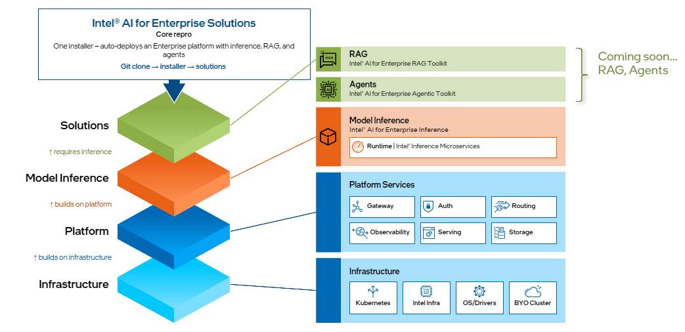

# Intel® AI for Enterprise Solutions

[](LICENSE)
[](https://www.intel.com/xeon)
[](https://kubernetes.io)
[](https://vllm.ai)
[](https://gateway.envoyproxy.io)
[](https://platform.openai.com/docs/api-reference)

**The fast path to deploying enterprise AI on Intel® Xeon® silicon. Go from bare metal to a working AI stack in minutes.**

> Deploy and connect LLM inference, RAG, and agentic workflows in a customizable Kubernetes-based platform — with a GenAI gateway, security, intelligent routing, observability, model serving, and infrastructure automation built in.

---

## What is Intel® AI for Enterprise Solutions?

Enterprise AI needs more than a model endpoint. Teams need to connect LLM inference, RAG, and agentic workflows, along with security, routing, and observability.

Intel® AI for Enterprise Solutions wires these pieces together in a pre-integrated, customizable Kubernetes stack optimized for Intel® Xeon® processors.

A single installer script, `es_auto_installer.sh`, takes bare-metal nodes through Kubernetes provisioning, platform services (networking, security, observability), model serving, and AI gateway setup — delivering a production-ready AI platform with OpenAI-compatible endpoints in one run.

The end result: teams get a secured, load-balanced inference stack with OpenAI-compatible endpoints, monitored through a unified gateway. This release delivers the inference foundation — the base on top of which RAG and agentic services can be deployed. Start with defaults, then configure or extend as needed.

> Want the full picture? See [Architecture](docs/reference/architecture.md) and [Meet AI for Enterprise Solutions](docs/meet/meet.md).

## Architecture

The stack installs in three ordered layers, from the base up:

| Layer | Components |
| --- | --- |
| **Inference** | Envoy AI Gateway, KServe, vLLM / OpenVINO™ Model Server — exposes the model endpoint on top of which services like RAG and agents can be built |
| **Platform** | Istio ambient mesh, Envoy Gateway, PostgreSQL, Keycloak, MinIO, observability |
| **Infrastructure** | Kubernetes (via Kubespray), storage |

**Request flow:** a request enters through the Envoy AI Gateway, is authenticated against Keycloak (or a LiteLLM virtual key), and is routed to the matching model-serving backend. Every layer's health and latency is visible in the built-in Grafana / Prometheus / Loki / Tempo stack.

<p align="center">
  
</p>

> See the [Architecture deep-dive](docs/reference/architecture.md) for the full component list, execution flow, and cross-repo layering.

---

## Quick Start

**Deploys the full stack on a single node locally with defaults.** In three steps, you'll serve an LLM and get a response. The Quick Start stops at inference; from there, you can use the deployed endpoint as the foundation for RAG applications and AI agents.

> [!NOTE]
> **Prerequisites:** Ubuntu 22.04/24.04 (or RHEL/Rocky x86_64), passwordless sudo, and internet access. Full list → [Prerequisites](docs/quickstart/prerequisites.md).

### Step 1 — Install the stack

Clone the repo and run the installer. This provisions Kubernetes on localhost and deploys the full stack (model serving, gateway, auth, observability).

All stack configuration options reside in `env/<name>/global_config.yaml` (created by `init`). With defaults, the auth provider is **`keycloak`** — Keycloak OIDC JWT with full identity management, SSO, and role-based access.

For a full list of configurable options, see [Configuration Reference](docs/customize/configuration.md). For detailed installation steps (multi-node, bastion, BYO cluster) and the alternative `litellm` virtual-key auth mode, see [Deployment Guide](docs/deploy/install_platform.md).

```bash
git clone https://github.com/intel/enterprise-ai-solutions.git
cd applications.ai.enterprise.ai-solutions

./es_auto_installer.sh configure          # one-time machine prep (installs Python 3.11+, yq, kubectl, helm)
./es_auto_installer.sh init local         # create the "local" environment
./es_auto_installer.sh install --all      # deploy everything (takes ~15–20 min)
```

Point `kubectl` at the new cluster:

```bash
export KUBECONFIG=$(pwd)/env/local/kubeconfig.yaml
kubectl get nodes   # should show Ready
```

> [!TIP]
> `--env` defaults to `local`, so `install --all` is the same as `install --all --env local`.
> Tear down everything (config preserved) with `./es_auto_installer.sh teardown --all`.

> [!WARNING]
> Install and teardown operations are environment-scoped. If you installed with `--env prod`, you must teardown with `--env prod`. Running teardown against a different environment (e.g. `local`) will not affect the intended target.

### Step 2 — Deploy a model

The model-manager downloads weights, selects optimal serving parameters, and creates the pod — no YAML needed.

Deploy `qwen3-0-6b` — one of the predefined models in the built-in catalog, so no sizing or configuration is needed:

```bash
./model-manager deploy qwen3-0-6b --wait
```

Or skip the catalog and deploy any Hugging Face model directly by repo ID, specifying the CPU and memory to allocate:

```bash
./model-manager deploy --id Qwen/Qwen3-4B --cpu 16 --memory 32Gi --wait
```

> [!IMPORTANT]
> Gated models (Llama, Mistral, …) require a free [Hugging Face token](https://huggingface.co/settings/tokens).
> Export it as `HF_TOKEN=hf_...` before deploying.

When the command returns, it prints your inference endpoint and a ready-to-run `curl` example.

### Step 3 — Send your first request

With the default `auth_provider: keycloak`, the helper script auto-discovers gateway IP, Keycloak credentials, and fetches a JWT — all from the cluster:

```bash
source ./ext/enterprise.ai-inference/model_manager/scripts/get-keycloak-token.sh
# Exports: TOKEN, GATEWAY_IP, GATEWAY_DOMAIN
```

Call the model:

```bash
curl -sk --noproxy '*' \
  -H "Authorization: Bearer $TOKEN" \
  -H "Content-Type: application/json" \
  --resolve "inference.solutions.ai:443:$GATEWAY_IP" \
  -d '{"model":"qwen3-0-6b","messages":[{"role":"user","content":"Hello!"}],"max_tokens":64}' \
  https://inference.solutions.ai/v1/chat/completions
```

List available models:

```bash
curl -sk --noproxy '*' \
  -H "Authorization: Bearer $TOKEN" \
  --resolve "inference.solutions.ai:443:$GATEWAY_IP" \
  https://inference.solutions.ai/v1/models
```

> [!NOTE]
> Keycloak tokens expire after 15 minutes by default. Re-run the `source` command to get a fresh token, or use `--lifespan 3600` for a 1-hour token.
>
> Using `auth_provider: litellm` instead? See [Deploying and Accessing Models](docs/deploy/install_platform.md#deploying-and-accessing-models) for the virtual-key flow.

Everything speaks the OpenAI-compatible API, so any tool that works with OpenAI now works with your stack. For Python, see [Step 5 — Python (OpenAI Client)](docs/deploy/install_platform.md#5-access-the-model--python-openai-client) for ready-to-run examples.
Live metrics are available in Grafana at `https://grafana.<your-domain>` — the vLLM dashboard shows request rate, latency, TTFT, and token throughput.

### What you get

| Layer | Component | What it gives you |
|---|---|---|
| Identity & access | Keycloak (OIDC/JWT) | SSO, role-based access control, and gateway-enforced auth on every request |
| Model serving | vLLM, OpenVINO™ Model Server | OpenAI-compatible `/v1/chat/completions`, `/v1/completions`, and `/v1/models` endpoints, CPU-only |
| AI gateway | Envoy AI Gateway | Model-aware routing, rate limiting, and load balancing across serving backends |
| Observability | Grafana, Prometheus, Loki, Tempo | Request rate, latency, TTFT, and token-throughput dashboards out of the box |

| Keycloak — Identity & Access Management | Grafana — Inference Monitoring |
|:---:|:---:|
|  |  |

---

## Advanced

The Quick Start gets you running with single-node defaults. From here you can tailor almost everything — TLS and authentication, multi-node or bring-your-own cluster, storage backends, RAG pipelines, model catalogs, autoscaling, proxies, and which components to enable or swap.

| Goal | Guide |
|---|---|
| All configuration options | [Configuration Reference](docs/customize/configuration.md) |
| Multi-node cluster or BYO Kubernetes | [Topologies](docs/deploy/topologies.md) |
| Deploy and manage models | [Deploy Models](docs/deploy/deploy_models.md) |
| Connect your app or framework | [Integration Guide](docs/customize/integration.md) |
| CLI commands and flags | [CLI Reference](docs/customize/cli.md) |
| Architecture deep-dive | [Architecture](docs/reference/architecture.md) |
| Network topology and ingress | [Network Architecture](docs/deploy/networking.md) |
| Workload placement (multi-node) | [Node Topology](docs/customize/node_topology.md) |
| NUMA-aware CPU pinning | [NRI CPU Balloons](docs/customize/nri_cpu_balloons.md) |

---

## License

Licensed under the [Apache License, Version 2.0](LICENSE).

## Links

- [Documentation Index](docs/README.md)
- [GitHub Repository](https://github.com/intel/enterprise-ai-solutions)
- [Intel® Enterprise for AI Inference (inference layer)](https://github.com/intel/enterprise-inference)
- [Meet AI for Enterprise Solutions](docs/meet/meet.md)
- [Architecture](docs/reference/architecture.md)

---

*Intel®, Intel® Xeon®, and Intel® Arc™ are registered trademarks of Intel Corporation or its subsidiaries. Licensed under the Apache License, Version 2.0.*
